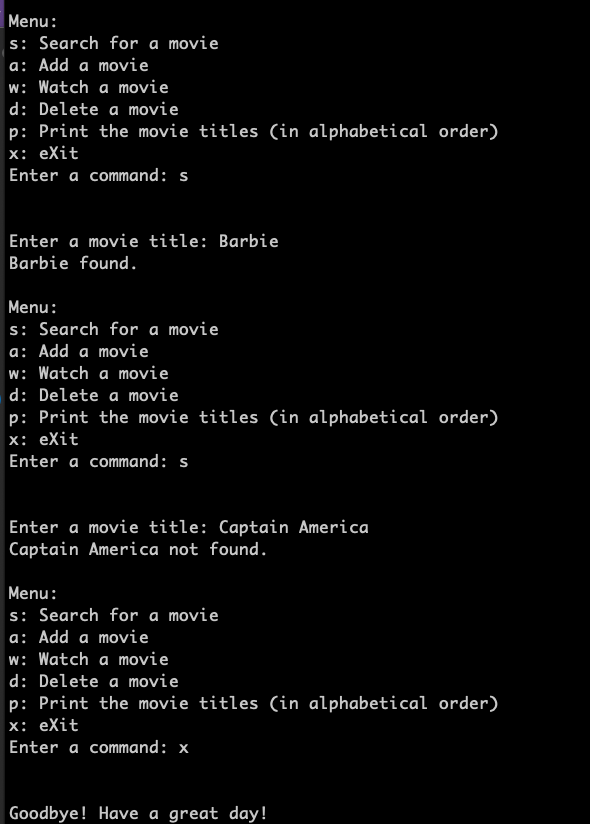
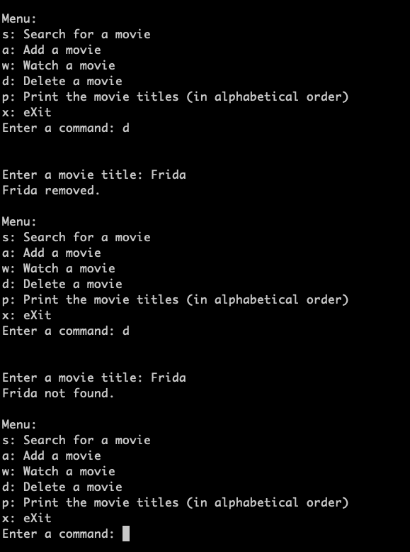

### <p style="text-align: center;">Project Binary Search Tree</p>
### <p style="text-align: center;">Data Structures CSCI 2320

#### Project Objective
Learn how to use a Binary Search Tree (BST) ADT in C++ to solve a problem.

#### Project Overview
Your mission is to implement a **BearFlix** movie application that will save a list of movies you want to watch.  You will  be given a list of movies you want to watch called `movie_queue.txt`, which should be managed as a `BST`.  You will be given a partially implemented `main.cpp` and a full implementation of `BST.h`.

#### Project Tasks

**Review Task**
- Clone the starter repository to your computer.
- Review the implementation of `BST.h`.  Recall that a `BST` is a tree structure for organizing and storing data in a sorted manner.  The tree may be traversed inorder, preorder, and postorder.

**Visual Studio 2022 Users**
- Create your Visual Studio 2022 Project and add the provided `main.cpp` file as well as the `BST.h`.
- Copy the following files to the same location as your project/solution files.
    - `movie_queue.txt`

**VS Code/Mac Users**
- You will need to run your program from the Terminal because it accepts input.  As always, please let me know if you have questions. 

**Develop your main driver**
In the partially implemented main driver `main.cpp` implement the following.
- Create a BST string object to manage your list of movies.
- Open the list of movies, `movies_queue.txt`, and insert each movie into the BST object.
- Display the menu and prompt for a command, perform the requested action, and continue until the user exits.
- When a user enters `s`, prompt the user for the movie name and Search for a movie in the BST. Display the movie name and appropriate message based upon whether or not the movie is found. (See messages below.)
- When a user enters `a`, prompt the user for the movie name and Add the movie name to the BST.  Display the movie name and appropriate message based upon whether the movie was added or already present. (See messages below.)
- When a user enters `w`, prompt the user for the movie name to Watch and remove the movie name from the BST. Display the movie name and appropriate message based upon whether the movie was watched or not present.
- When a user enters `d`, prompt the user for the movie name to Delete and remove the movie name from the BST. Display the movie name and appropriate message based upon whether the movie was deleted or not present.
- When a user enters `p`, Print the entire movie list in alphabetical order using the correct BST method.  Ensure that each movie is separated by a newline and is in alphabetical order.  Use the appropriate BST method and parameters to accomplish this task. Check your output file to ensure it is in the correct order and format.
- When the user enters `x`, eXit the program. 
- If the user enters an invalid command, display the appropriate message and continue.
- Before the program exits, save the list of movies from the BST to a file named `movie_queue_updated.txt`.  Ensure that each movie is separated by a newline and is in alphabetical order.  Use the appropriate BST method and parameters to accomplish this task. Check your output file to ensure it is in the correct order and format.

**Messages in your main driver**
Use the provided constant variables to print all the messages in your program. The exact messages will be required for grading.  Make sure you print the appropriate message for the situation and ask if you need clarification.

```
// File names
const std::string movie_file = "movie_queue.txt";
const std::string movie_file_updated = "movie_queue_updated.txt";

// Messages
const std::string msg_exit = "Goodbye! Have a great day!";

// Note: The name of the movie should precede these messages
const std::string msg_movie_found = " found.";
const std::string msg_movie_not_found = " not found.";
const std::string msg_movie_added = " added.";
const std::string msg_movie_present = " already present.";
const std::string msg_movie_watched = " watched.";
const std::string msg_movie_deleted = " removed.";

const std::string msg_movie_list = "Movie titles:";
const std::string msg_movie_list_empty = "Your movie list is empty.";

// Errors
const std::string error_file_open = "Error: Unable to open file: ";
const std::string error_invalid_command = "Invalid command.  Please try again.";
```
#### Example of BearFlix 
See the examples below as a guide for implementing BearFlix commands.



#### Rubric
| Name                     | Description                 | Points |
| ------------------------ | --------------------------- | ------: |
| Coding Style             | Run cpplint on student code | 5      |
| Test Exit                | Test user command           | 5      |
| Test Search              | Test user command           | 10     |
| Test Search Not Found    | Test user command           | 10     |
| Test Add                 | Test user command           | 15     |
| Test Add Already Present | Test user command           | 10     |
| Test Watch               | Test user command           | 10     |
| Test Delete              | Test user command           | 15     |
| Test Delete Not Found    | Test user command           | 10     |
| Test Print               | Test user command           | 10     |
| Total               |            | 100    |

#### Due Dates and Honor
The due date is specified on Blackboard. 

This is an ***independent*** programming project, and it is very important that you understand and abide by the ***academic integrity policy*** concerning programming projects.  Remember, your personal honor and integrity is far more important than your grade on the project. 

#### Grading 
This project is available in GitHub Classroom.  Accept the URL on Blackboard and then clone your repository to your machine for development. Your project will be partially graded automatically via GitHub.  Please check the grading results each time you check in your code.  Your final grade will be based upon your last sync to GitHub before the deadline.  I will be manually grading your project as well.

#### Project Artifacts
The following should be completed by the due date/time specified on Blackboard.
- Check in all source code changes to your GitHub repository.  Please check your URL using a web browser to verify that your changes have been synced.
- **Submit the URL for your repository to Blackboard.**

<p style="font-size:120%;color:navy;background:linen;padding:10px;text-align:center">&copy; Copyright 2024 by Michelle Talley <br> <br>You may not publish this document on any website or share it with anyone without explicit permission of the author. </p>

